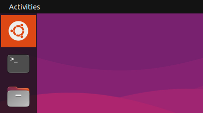
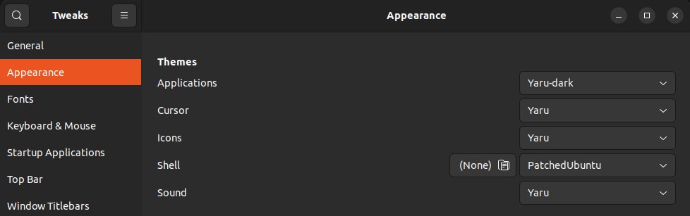

# patch-ubuntu-dock

What Ubuntu Dock should have been



## How to use?

You need to have Ubuntu 22.04 or higher, and follow these steps:

1. Install the required packages:
    ```bash
    $ sudo apt-get install gnome-tweaks gnome-shell-extension-manager chrome-gnome-shell
    ```

2. Apply some patches to Ubuntu Dock running next commands:
    ```bash
    $ sudo ./patch-ubuntu-dock.sh
    $ mkdir $HOME/.themes
    $ cp -R PatchedUbuntu/ $HOME/.themes
    ```

3. Enable **`User Themes`** extension opening this url: [https://extensions.gnome.org/extension/19/user-themes/](https://extensions.gnome.org/extension/19/user-themes/) install the web browser extension and click the slider ensuring the **ON** side to be active.

4. Open `Gnome Tweaks` App (Tweaks), go to `Appearance` section from the side panel and from `Shell` option select `PatchedUbuntu`.

    

5. Enjoy it!